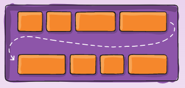

## Table of Content
1. [What is CSS](#what-is-css)
1. [How to CSS](#how-to-css)
    - Inline Style
    - Internal Style
    - External Style
1. [CSS Layouting In a Nutshell](#css-layouting-in-a-nutshell)
    - [Box Model](#box-model)
    - [Flex](#flex)
    - [Navbar with Flex](#navbar-with-flex)
    - [Grid](#grid)
1. [CSS Preprocessors](#css-preprocessors)
    - [SASS](#sass)
1. [Additional](#additional)
1. [References](#references)

### What is CSS
CSS, merupakan kependekan dari *Cascading Style Sheets* adalah suatu "bahasa"  
yang mendeskripsikan bagaimana Elemen dari HTML akan ditampilkan pada layar,  
kertas, ataupun media lainnya.

CSS ini tanpa kita sadari, kita sering mengkonsumsinya dan apabila kita  
sebagai developer *mengerti* menggunakannya, akan mempermudah hidup, karena  
dapat mengontrol tampilan layout dari berbagai ukuran situs web dalam satu  
kali pembuatan css.

Mari sekarang kita mencoba untuk melihat cara penggunaan cssnya

### How to CSS
Cara untuk menggunakan css ini sebenarnya terbagi menjadi beberapa cara:
- Inline style
- Internal style
- External style

#### Inline Style
Inline style, adalah dimana kita menggunakan / mendefinisikan css di dalam  
tag HTML itu sendiri
```html
<body>
  <!-- Ada style di dalam tag h1, inilah inline style -->
  <h1 style="color: #666;">Ini adalah inline style</h1>
</body>
```

Terlihat pada kode di atas, kita mendefinisikan css di dalam tag h1 itu sendiri.

Ini disebut dengan `inline style`.

Selanjutnya kita akan melihat `internal style`

#### Internal Style
Internal style, adalah dimana kita mendefinisikan style di dalam file html   
itu sendiri

```html
<head>
  <!-- Ini adalah internal style -->
  <style>
    .internal-style-h1 {
      color: blueviolet;
    }
  </style>
</head>
<body>
  <!-- Perhatikan di sini kita menggunakan class yang ada pada style -->
  <!-- yang didefinisikan pada tag style di atas -->
  <h1 class="internal-style-h1">Ini adalah internal style</h1>
</body>
```

Terlihat pada kode di atas, kita menggunakan tag "style" di dalam head,  
kemudian kita mendefinikan style di dalam tag style itu sendiri.

Ini disebut dengan `internal style`

Selanjut kita akan melihat `external style`

#### External Style
External style, adalah dimana kita mendefinisikan style di luar file html itu  
sendiri.

```html
<!-- File: index.html -->
<head>
  <!-- Perhatikan di sini kita menggunakan sebuah file css terpisah -->
  <!-- File ini terletak di src/index.css -->

  <!-- Ini adalah external style -->
  <!-- Perhatikan peletakannya sebelum internal style -->
  <link rel="stylesheet" href="src/index.css">
</head>
<body>
  <!-- Perhatikan di sini kita menggunakan class yang ada pada -->
  <!-- file css external -->

  <!-- Perhatikan di sini kita menggunakan class yang ada pada -->
  <!-- file: public/index.css -->
  <h1 class="external-style-h1">Ini adalah external style</h1> 
</body>
```

```css
/* File: src/index.css */
.external-style-h1 {
  color: burlywood;
}
```

Terlihat bahwa pada kode di atas, kita menggunakan sebuah file css terpisah  
dari file html yang ada. 

Ini disebut dengan `external style`

Selanjutnya setelah mengenal tentang cara penulisan CSS kita akan belajar  
mengenai bagaimana melakukan layouting dengan CSS

### CSS Layouting in a Nutshell
Pada bagian ini kita akan mempelajari bagaimana cara melakukan layoting dengan  
CSS menggunakan `flex` dan `grid`.

Namun sebelum mempelajari itu, ada sedikit aturan css yang harus diketahui  
terlebih dahulu yah, khususnya mengenai `box model` pada CSS.

#### Box Model
Dalam CSS, sebenarnya apapun bentuknya, SELURUH hal / elemen yang dimunculkan  
oleh CSS bentuknya adalah sebuah `kotak` atau disebut dengan `box model`.

Cara kita mendeskripsikan ini adalah fondasi utama dari pembelajaran CSS itu  
sendiri !

Misalkan kita memiliki sebuah tag html sebagai berikut

```html
<p>Saya adalah sebuah paragraf yang hanya memiliki sebuah kalimat saja</p>
```

Kemudian kita akan membuat css untuk p nya adalah seperti ini
```css
p {
  width:100px;
  height: 50px;
  padding: 20px;
  border: 1px solid;
}
```

Maka, apabila kode ini dijalankan dan dilihat, konten (tulisannya) akan bablas  
ke bawah, mengapa demikian? karena pada tahap ini kita belum mengerti tentang  
`box model`, bagaimana `box model` ini dipengaruhi oleh aspek lainnya dalam  
CSS, dan bagaimana dalam mengontrol `box model` ini bisa membuat kita membuat  
CSS yang lebih bisa dipahami !

Lalu bagaimanakah cara kita menyelesaikan ini supaya border yang dibuat sesuai  
dengan konten yang ada saja?
```
hint: gunakan width dan height untuk set content yang flexible !
```

Pada pembelajaran ini kita tidak mendiskusikan bagaimana cara kita  
menyelesaikan solusi di atas, hanya saja, kita akan mempelajari area dalam  
box model ini ada apa saja.


Semuanya dimulai dari `content box` yang ada di sini, dimana merupakan area  
dimana konten (isi dari tag html) itu berada, dan `content box` ini, SANGAT  
bisa mengontrol ukuran dari tag html orang tua dari tag html ini, jadi  
`content box` ini merupakan area dimana ukurannya PALING variatif.

`padding box` mengelilingi `content box` dan ini adalah ruang dimana property  
`padding` diterapkan. Karena `padding` ini adalam di dalam kotak, latar  
belakang dari kotak akan terlihat di dalam ruang yang dibuat ini.

`border box` akan mengelilingi `padding box` dan ruang ini akan tergantung  
dari nilai `border` yang dibuat. umumnya digunakan untuk memvisualisikan  
bingkai di dalam sebuah element.

area terakhir `margin box` adalah ruang keliling di seluruh kotak yang ada,  
didefinisikan berdasarkan aturan `margin` yang ada di kotak. Property css  
seperti `outline` ataupun `box-shadow` akan memengaruhi `margin box` ini.

Sepertinya ribet yah untuk memahami `box model` ini?

Jadi mari kita coba pelajari ini lebih lanjut dengan analogi berdasarkan  
gambar berikut:


Berdasarkan gambar di atas, kita memiliki 3 foto berbingkai, yang di-*templok*  
pada tembok, dengan jarak satu sama lain.

Pada gambar ini terlihat bahwa:
- `content box` merupakan gambar seninya
- `padding box` merupakan ruang putih, antara bingkai dengan gambar seninya
- `border box` merupakan bingkai dari gambar seni tersebut
- `margin box` merupakan ruang jarak antar bingkai satu dengan yang lainnya
- `shadow` yang memiliki ruang yang sama dengan si `margin box` yang ada

Nah setelah kita mengetahui `box model` ini, barulah kita masuk ke materi  
utama kita, yaitu Layouting, dengan Flex dan Grid !

#### Flex
`Flexbox Layout` atau dikenal dengan Flex, merupakan mekanisme layout yang  
didesain untuk mengelompokkan sekumpulan barang di dalam wadah dengan bentuk  
satu dimensi yang sama, misalnya semua di sumbu yang sama (horizontal atau  
vertical), TANPA mengetahui ukuran yang ada a.k.a dinamis (sehingga dinamakan  
Flex / flexbible).

Di dalam `Flexbox` ini dikenal beberapa istilah yang perlu dimengerti terlebih  
dahulu:
- Container
- Items

Container: sebuah "wadah" atau "tempat" yang digunakan untuk menampung "items"
Items: adalah "elemen" yang berisi konten yang diinginkan

Analoginya di sini, Container akan bertindak sebagai `parent` yang akan  
`mengayomi` anakannya `children` yaitu Items.

Pada pembelajaran ini kita akan menggunakan dokumentasi yang telah disediakan  
pada tautan [ini](https://css-tricks.com/snippets/css/a-guide-to-flexbox/)

Dalam tautan di atas, pada bagian `Flexbox Properties` kita akan mencoba untuk  
membaca dan mengimplementasikan Flexbox dan css attributenya yang ada pada   
bagian parent (yang berwarna ungu) dan children (yang berwarna kuning).

Disclaimer bahwa sebenarnya nama classnya bukan menjadi `parent-xxx` ataupun  
`child-xxx`, ini hanya sekedar analogi nya saja.

Pertama-tama kita akan masuk ke bagian yang `Flex direction`, dimana ini  
adalah cara peletakkan items di dalam container itu bagaimana.

Ada 4 direction yang ada di dalam sini:
- row -> items akan diurutkan secara left to right
- row (reverse) - items akan diurutkan secara right to left
- column - items akan diurutkan dari atas ke bawah
- column (reverse) - items akan diurutkan dari bawah ke atas

Nah daripada kita bingung ini maksudnya apa, sebaiknya kita langsung mencoba  
untuk melihatnya saja ini bagaimana membuatnya yah !

Mari buat sebuah file `index-flex.html` dimana kita akan  
mendefinisikan sebuah "container" dan beberapa "items" di sini yah

```html
<!DOCTYPE html>
  <body>
    <meta charset="UTF-8" />
    <meta http-equiv="X-UA-Compatible" content="IE=edge" />
    <meta name="viewport" content="width=device-width, initial-scale=1.0" />
    <title>Document</title>
    <link rel="stylesheet" href="src/index.css"></link>
  </head>
  <body>
    <!-- Flexbox section -->
    <!-- Ini adalah bagian containernya -->
    <div class="container">
      <!-- Ini adalah bagian itemsnya -->
      <div class="items red">1</div>
      <div class="items purple">2</div>
      <div class="items blue">3</div>
      <div class="items teal">4</div>
      <div class="items amber">5</div>
    </div>
    <!-- End of Flexbox section -->
  </body>
</html>
```

Nah untuk mempercantik, sekaligus bisa melihat batasan antara jarak dan kotak  
yang ada, maka kita akan menggunakan warna yang disediakan dari  
`Material Color Tool` pada tautan [ini](https://material.io/resources/color/)

Misalnya color yang akan kita gunakan untuk 5 items di atas adalah:
- red-100
- purple-100
- blue-100
- teal-200
- amber-100

Maka selanjutnya kita akan mendeskrsipsikan warna tersebut di dalam class

```html
<!-- Flexbox section -->
<!-- Ini adalah bagian containernya -->
<div class="container">
  <!-- Ini adalah bagian itemsnya -->
  <div class="items red">1</div>
  <div class="items purple">2</div>
  <div class="items blue">3</div>
  <div class="items teal">4</div>
  <div class="items amber">5</div>
</div>
<!-- End of Flexbox section -->
```

Kemudian kita akan menambahkan warna tersebut di dalam file `src/index.css`  
yang sudah dibuat

```css
.red {
  background-color: #ffcdd2;
}

.purple {
  background-color: #e1bee7;
}

.blue {
  background-color: #bbdefb;
}

.teal {
  background-color: #80cbc4;
}

.amber {
  background-color: #ffecb3;
}
```

Sebagai penambahan visual kita akan menambahkan sedikit css untuk class items

```css
.items {
  padding: 16px;
  font-size: 3em;
}
```

Terlihat dari sini bahwa *by default*, ukuran div itu lebarnya adalah 100%  
ukuran layar per "items" yang ada.

Sekarang kita akan coba mulai menggunakan flex, dengan mendeskripsikannya pada  
parent yang mendiami items, yaitu class `container`, yaitu dengan menambahkan  
property `dislay: flex` untuk class `container`.

```css
.container {
  display: flex;
}
```

By default untuk flex sudah property default disiapkan cukup banyak:
- flex-direction adalah `row`
- flex-wrap adalah `nowrap`
- justify-content adalah `flex-start`
- align-items adalah `stretch`

Sehingga apabila ingin dituliskan kembali dengan hasil yang sama, maka css  
yang harus ditulis adalah

```css
.container {
  display: flex;
  flex-direction: row;
  flex-wrap: nowrap;
  justify-content: flex-start;
  align-items: stretch;
}
```

Sekarang kita akan mencoba masuk terlebih dahulu untuk property  
`flex-direction`.

Coba kita menggantinya menjadi `row-reverse` / `column` / `column-reverse` dan  
kita akan melihat hasilnya.

Namun by default ini pada saat direverse, posisinya tidak akan ada di bawah.  
supaya nanti posisinya ada di bawah, maka nanti kita harus menambahkan  
property `height`nya terlebih dahulu

```css
.container {
  display: flex;
  flex-direction: column-reverse;
  flex-wrap: nowrap;
  justify-content: flex-start;
  align-items: stretch;
  /* Ganti menjadi 99vh atau 100vh tergantung browser */
  height: 99vh;
}
```

Supaya kita bisa melihat batasan dari container ini, kita akan menambahkan  
property background-colornya juga yah

```css
.container {
  display: flex;
  flex-direction: column-reverse;
  flex-wrap: nowrap;
  justify-content: flex-start;
  align-items: stretch;
  /* Ganti menjadi 99vh atau 100vh tergantung browser */
  height: 99vh;
  /* Grey 300 */
  background-color: #e0e0e0;
}
```

Pada saat kita mengganti-ganti flex-direction ini, sebenarnya terlihat bahwa  
items ini ukurannya akan mengikuti container yang ada, hal ini dikarenakan  
align-items yang kita gunakan adalah `stretch` by defaultnya, padahal kan  
seharusnya itemsnya berdiri sendiri ukurannya? 

Bagaimana cara kita mengakalinya?

Nanti akan kita pelajari lebih lanjut maksudnya apa yah !

Sekaran kita akan kembalikan lagi flex-directionnya menjadi row lagi, tanpa  
`height` terlebih dahulu yah !

```css
.container {
  display: flex;
  flex-direction: row;
  flex-wrap: nowrap;
  justify-content: flex-start;
  align-items: stretch;
  /* Ganti menjadi 99vh atau 100vh tergantung browser */
  /* height: 99vh; */
  /* Grey 300 */
  background-color: #e0e0e0;
}
```

Nah sebelum kita lanjut lebih dalam, ada sedikit lagi terminologi yang harus  
diketahui yah, yaitu di sini akan ada `main-axis` dan `cross-axis`.


Pada flex-direction row, `main-axis` atau sumbu utamanya dari row ini adalah  
sumbu x (horizontal) dan `cross-axis` atau sumbu silangnya adalah sumbu y  
(vertical).

Sedangkan pada flex-direction column, adalah kebalikannya,  
`main-axis` sumbu y, dan `cross-axis` adalah sumbu x.

Barulah sekarang kita masuk untuk manipulasi peletakkan items.

Misalnya dengan menggunakan property `justify-content`.

Property `justify-content` ini akan mengatur peletakkan items berdasarkan  
`main-axis` yang ada (perataan items sepanjang `main-axis`).

Pada direction `row` brarti sumbu x (horizontal)
Pada direction `column` berarti sumbu y (vertical)

Untuk property dari `justify-content` ini dapat dilihat di sini:  


Langsung saja kita cobakan pada file css yang dimiliki untuk mencoba mengganti  
property `justifty-content` tadi yah !

Yang perlu diperhatikan adalah pada value `space-xxx`:
- `space-between` artinya spacing (jarak) antar item akan dibuat sama "jauh"  
  
- `space-around` artinya akan memberikan spacing (jarak) yang sama antar kiri  
  dan kanan itemnya  
  
- `space-evenly` artinya jaraknya akan dibuat semuanya merata, baik dari  
  `main-axis` yang terdekat (pada row artinya terkiri) s.d. `main-axis`  
  terjauh (pada row artinya terkanan)  
  

(Apabila pada flex-direction `column` artinya yang dilihat adalah terhadap  sumbu y vertical yah !)

Masuk ke property selanjutnya pada flex, yaitu `align-items`, dimana mengatur  
peletakkan items yang ada terhadap `cross-axis` dari flex tersebut

Pada direction `row` berarti sumbu y (vertical)
Pada direction `column` berarti sumbu x (horizontal)

Untuk property dari `align-items` ini dapat dilihat di sini:  


Langsung saja kita cobakan pada file css yang dimiliki untuk mencoba mengganti  
property `align-items` ini yah !

Sebelumnya kita akan menyalakan kembali property heightnya pada css yah !
```css
.container {
  display: flex;
  flex-direction: row;
  flex-wrap: nowrap;
  justify-content: center;
  align-items: stretch;
  /* Ganti menjadi 99vh atau 100vh tergantung browser */
  height: 99vh;
  /* Grey 300 */
  background-color: #e0e0e0;
}
```

Mari kita coba untuk mengganti-ganti kannya ke `flex-start` / `flex-end` /  
`center`

Nah sekarang, bagaimanakah caranya untuk meletakkan items ini semuanya pada  
kanan bawah?

```css 
.container {
  display: flex;
  flex-direction: row;
  flex-wrap: nowrap;
  justify-content: flex-end;
  align-items: flex-end;
  /* Ganti menjadi 99vh atau 100vh tergantung browser */
  height: 99vh;
  /* Grey 300 */
  background-color: #e0e0e0;
}
```

Oke, sekarang kita akan mengembalikan valuenya semuanya menjadi `flex-start`  
yah !

```css
.container {
  display: flex;
  flex-direction: row;
  flex-wrap: nowrap;
  justify-content: flex-start;
  align-items: flex-start;
  /* Ganti menjadi 99vh atau 100vh tergantung browser */
  height: 99vh;
  /* Grey 300 */
  background-color: #e0e0e0;
}
```

Sekarang kita punya permasalahan baru, apabila kita memiliki elemen items yang  
cukup banyak pada html kita, misalnya seperti berikut

```html
<!-- Flexbox section -->
<!-- Ini adalah bagian containernya -->
<div class="container">
  <!-- Ini adalah bagian itemsnya -->
  <div class="items red">1</div>
  <div class="items purple">2</div>
  <div class="items blue">3</div>
  <div class="items teal">4</div>
  <div class="items amber">5</div>

  <div class="items red">1</div>
  <div class="items purple">2</div>
  <div class="items blue">3</div>
  <div class="items teal">4</div>
  <div class="items amber">5</div>

  <div class="items red">1</div>
  <div class="items purple">2</div>
  <div class="items blue">3</div>
  <div class="items teal">4</div>
  <div class="items amber">5</div>

  <div class="items red">1</div>
  <div class="items purple">2</div>
  <div class="items blue">3</div>
  <div class="items teal">4</div>
  <div class="items amber">5</div>
</div>
<!-- End of Flexbox section -->
```
Sekarang ini kita melihat bahwa ternyata, items ini `ngeyel` melewati  
containernya, menjadi bablas searah `main axis` yang ada.

Bagaimanakah cara kita untuk membuat nya `menurut` dengan container, sehingga  
ketika sudah bablas, akan mengikuti arah container yang ada?

(Misalnya, pada direction row, bila bablas, akan turun ke bawah?)

Maka kita akan melihat property `flex-wrap`.

Valuenya adalah:
- `nowrap` (default), tidak akan ada wrap, (dibiarkan bablas)
- `wrap`, akan ada wrap, searah cross axis, dari terdekat hingga terjauh
- `wrap-reverse`, akan ada wrap, searah cross axis, namun dari terjauh hingga
   terdekat



Silakan dicoba untuk mengganti property `flex-wrap` ini dan lihatlah hasilnya !

Apabila sudah, mari kita kembalikan lagi untuk flex ini menjadi 5 item saja

```html
<!-- Flexbox section -->
<!-- Ini adalah bagian containernya -->
<div class="container">
  <!-- Ini adalah bagian itemsnya -->
  <div class="items red">1</div>
  <div class="items purple">2</div>
  <div class="items blue">3</div>
  <div class="items teal">4</div>
  <div class="items amber">5</div>
</div>
<!-- End of Flexbox section -->
```

Sekarang bagaimanakah bila kita ingin meletakkan item nomor `5` itu di tengah?

Apakah kita harus mengganti urutan peletakkan-nya sehingga menjadi di tengah?

Maka kita bisa menambahkan `order` di dalam flex ini

```html
<!-- Flexbox section -->
<!-- Ini adalah bagian containernya -->
<div class="container">
  <!-- Ini adalah bagian itemsnya -->
  <div class="items red" style="order: 1;">1</div>
  <div class="items purple" style="order: 2;">2</div>
  <div class="items blue" style="order: 4;">3</div>
  <div class="items teal" style="order: 5;">4</div>
  <div class="items amber" style="order: 3;">5</div>
</div>
<!-- End of Flexbox section -->
```

Selain itu untuk pembagian spacingnya per item di dalam `main-axis` kita juga  
bisa menggunakan `flex-grow`, misalnya pada item tertentu, ingin menempati slot
yang lebih banyak drpd item lainnya, maka bisa menggunakan `flex-grow`.

Kemudian bisa juga apabila ada items yang `ingin melawan kodrat` dari sisi  
peletakkannya, bisa menggunakan `align-self`

dan ada banyak property lainnya lagi, bisa dicoba sendiri yah !

Dan ada sedikit juga nih games yang bisa membantu kita memperdalam Flex ini,  
yaitu [Flexbox Froggy](Https://flexboxfroggy.com)

#### Navbar with Flex
Misalnya sekarang kita ingin membuat navbar dengan flex


Bagaimana cara kita membuatnya?

1. Buat sebuah file baru dengan nama `index-flex.html` dan sebuah css baru  
   dengan nama `src/index.css`
1. Pada pembelajaran ini kita akan menggunakan font-awesome, sebagai icon yang  
   akan digunakan.
1. (Untuk menggunakannya, buka fontawesome.com/start), register, dan dapatkan  
   embed codenya, kemudian gunakan
1. Tambahkan html sebagai berikut:
```html
<!DOCTYPE html>
<html lang="en">
  <html>
    <meta charset="UTF-8" />
    <meta http-equiv="X-UA-Compatible" content="IE=edge" />
    <meta name="viewport" content="width=device-width, initial-scale=1.0" />
    <title>Belajar Navbar</title>
    <!-- Navbarcss -->
    <link rel="stylesheet" href="src/navbar.css">
    <!-- Font awesome -->
    <script
      src="https://kit.fontawesome.com/77aa9c5b96.js"
      crossorigin="anonymous"
    ></script>
  </head>
  <body>
    <!-- Navigation bar -->
    <nav>
      <div class="logo">
        LOGO
      </div>
      <div class="links">
        <ul>
          <li>Discover</li>
          <li>Connect</li>
          <li>Community</li>
          <li>Discover</li>
        </ul>
      </div>
      <div class="links right">
        <ul>
          <!-- Di sini kita menggunakan font awesome punya icon -->
          <li><a href=""><i class="fa fa-search"></i></a></li>
          <li><a href=""><i class="fa fa-envelope"></i></a></li>
        </ul>
      </div>
    </nav>
  </body>
</html>
```

```css
* {
  margin: 0;
}

body {
  font-family: Verdana, Geneva, Tahoma, sans-serif;
}

nav {
  display: flex;
  /* orange 400 material color palette */
  background-color: #ffa726;
  justify-content: space-between;
  align-items: center;
  padding: 16px;
}

nav > .links {
  display: flex;
}

nav > .links > ul > li {
  list-style: none;
  display: inline;
  margin-left: 16px;
}

/* anak pertama ga boleh geser ke kiri */
nav > .links > ul > li:first-child {
  margin-left: 0;
}

/* Icon berubah jadi abu abu */
nav .links a {
  text-decoration: none;
  color: #646464;
}
```

Mantap, sekarang kita sudah berhasil untuk membuat navbarnya !

Sekarang mari kita analisa gambar berikut


Ini adalah sebuah `Card View`

Bagaimanakah cara kita membuatnya?

(Di sini kita analisis saja yah, tidak mencontohkan pembuatannya)

Oke sudah sudah, mari selesai membahas flexnya, sekarang kita akan masuk ke  
bagian layouting yang satunya lagi yang populer selain flex, yaitu yang  
bernama `Grid` atau `Grid System`

#### Grid
`Grid System` adalah sebuah `Flex` tingkat lanjut, yang digunakan oleh   
beberapa perusahaan dan menjadi fondasi framework untuk pengaturan peletakkan  
elemen dalam website.

Komponen utamanya adalah `container`, `row`, dan `column`

Nah loh, kok mirip dengan `tabel`?

Nah inilah cikal bakalnya !

Di sini kita akan berusaha untuk mengimplementasikan Grid system ini dengan  
menggunakan suatu UI Framework yang bernama `bootstrap` yah.

Sebenarnya ada banyak alternatifnya, seperti materializecss, semanticui, dll,  
Namun yang digunakan dalam pembelajaran ini adalah bootstrap yah !

Mari kita coba membuka tautan https://getbootstrap.com/docs/5.1/layout/grid/

Di sini diketahui bahwa dalam `grid system` yang digunakan oleh bootstrap  
(dan mayoritas ui framework lainnya) menggunakan sistem 12 kolom, namun ada  
juga yang menggunakan jumlah kolom yang berbeda.

FYI container yang digunakan di dalam bootstrap ini, sedikit berbeda dengan  
yang dibuat di atas, karena sudah ada css tambahan yang diselipkan per class  
yang ada di dalam bootstrap ini (bisa dilihat dengan inspect element).

Pada bootstrap ini, untuk mengadopsi grid system ini, menggunakan class
`container` yang di dalamnya ada `row` yang di dalamnya `column`.
```
div.container > div.row > div.column
```

Dan pada bootstrap ini, berdasarkan layar resolusi tertentu, sudah dibuat  
`breakpoints`nya, yaitu, untuk layar tertentu, akan mengadopsi cara penampilan  
tertentu, yang kemungkinan, kalau dibuat sendiri cssnya, akan menghadapi   
effort yang lebih untuk mencapai tampilan yang `responsif`.

Misal: pada layar komputer, dibagi jadi 3 bagian, kalau di hp, akan ada 1  
layar saja.

Tiap framework = `breakpoints` berbeda

Sekarang kita akan mencoba mengimplementasikan grid dengan bootstrap !

1. Buatlah sebuah file baru `index-grid.html`
1. Buka bootstrap > getting started > cdn > copy
1. Masukkan ke dalam `index-grid.html` dan gunakan untuk membuat grid
```html
<!DOCTYPE html>
<html lang="en">
  <head>
    <meta charset="UTF-8" />
    <meta http-equiv="X-UA-Compatible" content="IE=edge" />
    <meta name="viewport" content="width=device-width, initial-scale=1.0" />
    <title>Latihan Grid</title>
    <!-- Bootstrap CDN -->
    <link
      href="https://cdn.jsdelivr.net/npm/bootstrap@5.1.1/dist/css/bootstrap.min.css"
      rel="stylesheet"
      integrity="sha384-F3w7mX95PdgyTmZZMECAngseQB83DfGTowi0iMjiWaeVhAn4FJkqJByhZMI3AhiU"
      crossorigin="anonymous"
    />
  </head>
  <body>
    <!-- By default bootstrap container ada jarak kiri kanan -->
    <!-- Bila ingin mengisi penuh, gunakan container-fluid -->
    <div class="container">
      <div class="row">
        <!-- Bila ingin mengatur lebarnya gunakan col-x -->
        <!-- dimana x adalah 1 s.d. 12 (12 col grid system) -->
        <div class="col" style="background-color: antiquewhite">Hello</div>
        <div class="col" style="background-color: burlywood">Grid</div>
        <div class="col" style="background-color: dodgerblue">System</div>
      </div>

      <div class="row mt-4">
        <div class="col-6" style="background-color: antiquewhite">Hello</div>
        <div class="col-6" style="background-color: burlywood">Grid</div>
        <div class="col-3" style="background-color: dodgerblue">System</div>
      </div>
    </div>
  </body>
</html>
```

Untuk mempelajari lebih lanjut tentang pure CSS tentang grid, bisa mencoba  
untuk membuka tautan https://cssgridgarden.com yah !

Masuk ke bagian terakhir dalam pembelajaran hari ini, cukup panjang yah !

Tenang ini hanyalah perkenalan saja loh #eh 😂

Mari kita berkenalan dengan CSS Preprocessors yang bernama SASS.

### CSS Preprocessors
Sebenarnya dalam CSS ini sendiri, kita tidak bisa memasukkan variable variable  
layaknya javascript dan bahasa pemrograman lainnya.

Namun bagaimanakah bila kita membutuhkan hal tersebut dan fitur fitur lainnya?

Maka kita harus menggunakan `css on steroid` yang bernama `CSS Preprocessor` !

Dan salah satu CSS Preprocessor yang cukup terkenal luas adalah `SASS`

Di sini kita bisa menggunakan looping, variable, extends, dll dkk di SASS ini !

#### SASS
Cara menggunakan SASS adalah dengan memasangnya secara global yaitu dengan 
```
npm install -g sass
```

Package sass ini bisa membaca 2 tipe file: scss dan sass, perbedannya hanyalah  
pada semicolon dan bracket saja.

Untuk menyamakan dengan css, yang akan digunakan pada pembelajaran ini adalah  
yang `scss` yah !

Mari kita coba membuatnya setelah memasang di sass di atas.

1. Buatlah sebuah file dengan nama `src/custom.scss`
1. Masukkan kode berikut ke dalam `src/custom.scss` ini
```scss
$font-stack: Helvetica, sans-serif;
$primary-color: #333;

body {
  font: 100% $font-stack;
  color: $primary-color;
}
```
1. Buka sebuah terminal
1. Jalankan perintah `npx sass --watch custom.scss custom.css`.  
   Perintah ini meminta sass untuk melakukan observasi perubahan konten pada  
   file `custom.scss` dan membuatkan outputnya menjadi file `custom.css`.  
   Setiap kali ada perubahan, akan selalu dikompilasi menjadi file   
   `custom.css` (dengan asumsi file tidak error)
1. Bukalah file `custom.css` yang terbentuk dan lihat hasilnya !
1. Selanjutnya mis. kita akan menggunakan scss ini untuk memudahkan penulisan  
   pada file `navbar.css` yang dibuat sebelumnya.  
   (Permisalan yah, tidak dibuat persis)
```scss
nav {
  .links {
    display: flex;
  }
  li {
    list-style: none;
    display: inline;
  }
}
```
1. Kemudian sesuai dengan kata kata `css on steroid`, scss ini juga mendukung  
   looping
```scss
@for $i from 1 through 12 {
  col-#{$i} {
    position: relative;
    padding-left: 16px;
    padding-right: 16px;
  }
}
```

Sekian dan sedikit ini saja untuk introduction terhadap sass ini, selanjutnya  
bisa dicoba untuk eksplorasi sendiri yah dan selamat belajar !
### Additional
#### CSS Specificity
- https://web.dev/learn/css/specificity/

### References
- https://www.w3schools.com/css/css_intro.asp
- https://www.hostinger.com/tutorials/difference-between-inline-external-and-internal-css
- https://web.dev/learn/css/
- https://sass-lang.com/
- https://css-tricks.com/snippets/css/a-guide-to-flexbox/
- https://css-tricks.com/snippets/css/complete-guide-grid/
- https://getbootstrap.com/docs/5.1/layout/grid/
- https://gridgarden.com
- https://sass-lang.com